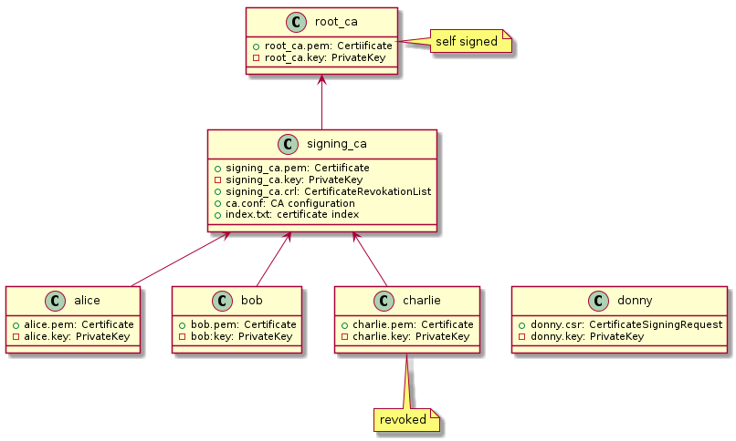

# Test PKI

Some of the examples in this repository make use of a test PKI. Use the following commands to create the PKI:

```bash
cmake -B build
cmake --build build
./build/create_test_pki
```

This will create or update the PKI in `test-pki` directory.



## PKI structure

- root_ca:  
  Contains a self-signed certificate which acts as the root of our PKI.
- signing_ca:   
  Contains a certificate issued by the `root_ca` used to sign user certificates.
  Also contains a certificate revokation list (CRL).
- alice, bob, charlie:  
  Each directory contains a certificate used to create digital signatures.
  Note that the certificate of `charlie` is revoked.
- donny:  
  Contains a certificate signing request.

## Verify PKI using openssl

To verify the PKI, the `openssl` command line tool can be used.

### Display certificate contents

```bash
openssl x509 -in CERTFILE -text -noout
```

#### Example

```bash
openssl x509 -in test-pki/root_ca/root_ca.pem -text -noout

Certificate:
    Data:
        Version: 3 (0x2)
        Serial Number: 1 (0x1)
        Signature Algorithm: sha256WithRSAEncryption
        Issuer: DC = org, DC = exampe, O = Example org, OU = CA Department, CN = Root CA
        Validity
            Not Before: Nov 19 19:07:30 2023 GMT
            Not After : Nov 29 19:07:30 2023 GMT
        Subject: DC = org, DC = exampe, O = Example org, OU = CA Department, CN = Root CA
        Subject Public Key Info:
            Public Key Algorithm: rsaEncryption
                Public-Key: (4096 bit)
                Modulus:
                    00:8f:74:ce:c2:9c:47:1b:5d:a0:57:4b:c8:59:5a:
                    ...
                Exponent: 65537 (0x10001)
        X509v3 extensions:
            X509v3 Basic Constraints: critical
                CA:TRUE
            X509v3 Key Usage: critical
                Certificate Sign, CRL Sign
            X509v3 Subject Key Identifier: 
                80:A1:EA:7A:EC:65:F6:B9:8B:31:0B:C0:47:A8:24:E3:23:E8:61:BD
            X509v3 Authority Key Identifier: 
                80:A1:EA:7A:EC:65:F6:B9:8B:31:0B:C0:47:A8:24:E3:23:E8:61:BD
    Signature Algorithm: sha256WithRSAEncryption
    Signature Value:
        19:0a:ce:c9:c4:9f:bb:d0:3f:bd:c2:83:64:f3:c2:46:86:a4:
        ...
```

### Display CRL contents

```bash
openssl crl -in CRSFILE -text -noout
```

#### Example

```bash
openssl crl -in test-pki/signing_ca/signing_ca.crl -text -noout

Certificate Revocation List (CRL):
        Version 2 (0x1)
        Signature Algorithm: sha256WithRSAEncryption
        Issuer: DC = org, DC = exampe, O = Example org, OU = CA Department, CN = Signing CA
        Last Update: Nov 19 19:07:32 2023 GMT
        Next Update: Nov 29 19:07:32 2023 GMT
Revoked Certificates:
    Serial Number: 03
        Revocation Date: Nov 19 19:07:32 2023 GMT
    Signature Algorithm: sha256WithRSAEncryption
    Signature Value:
        35:e0:b1:25:3f:7a:6a:5f:44:74:dc:3a:d6:29:d1:95:73:5c:
        ...
```
### Verify a certificate

```bash
openssl verify -show_chain -crl_check_all \
-CAfile CAFILE \
-CRLfile CRLFILE \
-untrusted INTERMEDIATE_CERTFILE \
CERTFILE
```

| Parameter | Example | Description |
| --------- | ------- | ----------- |
| CAFILE    | test-pki/root_ca/root_ca.pem | Path of a file containing one or more root certificates |
| CRLFile   | test-pki/signing_ca/signing_ca.crl | Path of file containing a certifacte revokation list |
| INTERMEDIATE_CERTFILE | test-pki/signing_ca/signing_ca.pem | Path of file containing intermediate certificate used to complete the certificate chain |
| CERTFILE | test-pki/alice/alice.pem | Path of the certificate to check |

#### Example

Verify a valid certificate:

```bash
openssl verify -show_chain -crl_check \
-CAfile test-pki/root_ca/root_ca.pem \
-CRLfile test-pki/signing_ca/signing_ca.crl \
-untrusted test-pki/signing_ca/signing_ca.pem \
test-pki/alice/alice.pem 

test-pki/alice/alice.pem: OK
Chain:
depth=0: DC = org, DC = exampe, O = Example org, OU = CA Department, CN = alice (untrusted)
depth=1: DC = org, DC = exampe, O = Example org, OU = CA Department, CN = Signing CA (untrusted)
depth=2: DC = org, DC = exampe, O = Example org, OU = CA Department, CN = Root CA
```

Verfiy a revoked certificate:

```bash
openssl verify -show_chain -crl_check_all \
-CAfile test-pki/root_ca/root_ca.pem \
-CRLfile test-pki/signing_ca/signing_ca.crl \
-untrusted test-pki/signing_ca/signing_ca.pem \
test-pki/charlie/charlie.pem 

DC = org, DC = exampe, O = Example org, OU = CA Department, CN = charlie
error 23 at 0 depth lookup: certificate revoked
error test-pki/charlie/charlie.pem: verification failed
```
